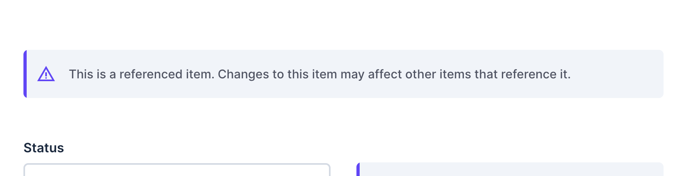

# Drawer Notice Interface for Directus

[](https://www.npmjs.com/package/directus-extension-drawer-notice)

A notice field that is only visible in the drawer.

```sh
# Install via npm
npm install directus-extension-drawer-notice
# Install via yarn
yarn add directus-extension-drawer-notice
# Install via pnpm
pnpm add directus-extension-drawer-notice
```

## Use Case

The main use case for this extension is to display a message when editing a related item in the drawer, to prevent users from accidentally overwriting the contents of an existing item.

Example:

